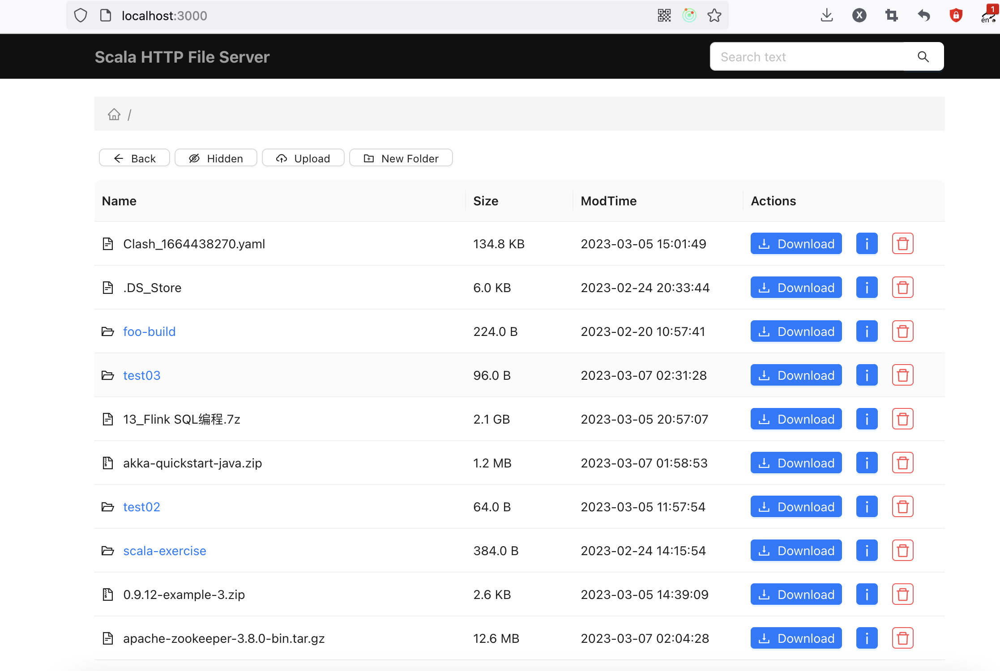

## 介绍
ScalaHttpServer Scala文件服务器




**Projects**
* react web基于react开发，学习视频(https://www.youtube.com/watch?v=Uz_EhDwUnRg&list=PLmOn9nNkQxJFJXLvkNsGsoCUxJLqyLGxu)
* ant design 提供了丰富的UI组件，简化了页面开发的时间和成本
* playframework 参考`play-scala-react-seed`（https://github.com/playframework/play-scala-react-seed），它提供了react和play两者一体化的开发和部署方式。

## 调试
IDEA中调试 Play服务接口，请勿使用`use sbt shell`

## Scala Play React Seed
服务是参考 scala play react seed项目模板构建，集成React的编译、打包、部署，

该项目的介绍请跳转至 https://github.com/playframework/play-scala-react-seed


* Used any of the following [SBT](http://www.scala-sbt.org/) commands which will intern trigger frontend associated npm scripts.

```
    sbt clean           # Clean existing build artifacts

    sbt stage           # Build your application from your project’s source directory

    sbt run             # Run both backend and frontend builds in watch mode

    sbt dist            # Build both backend and frontend sources into a single distribution artifact

    sbt test            # Run both backend and frontend unit tests
```